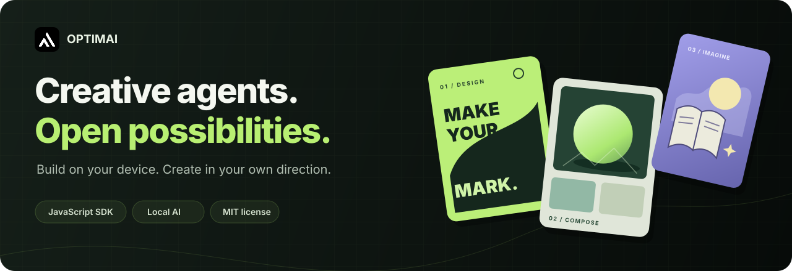
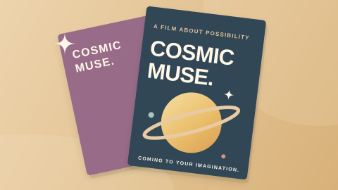
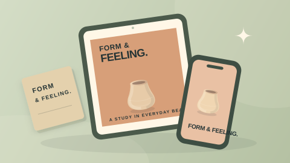
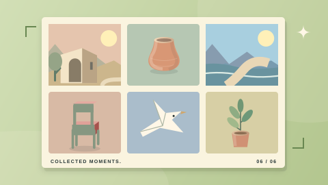
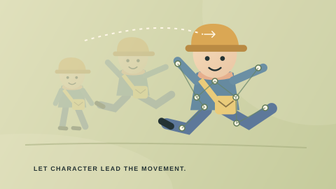
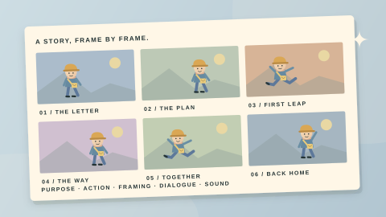

# OptimAI Creative Agents



[](https://github.com/OptimaiNetwork/optimai-creative-agents/actions/workflows/ci.yml)
[](./LICENSE)
[](./package.json)

**Open building blocks for creative agents. Local execution. Creative control.**

Build image workspaces, design utilities, story treatments and creative workflows with a small JavaScript SDK. Start with a working template, customize its recipe, or contribute a new reviewed engine. Use it in your own application or integrate it with [OptimAI Studio](https://optimai.studio/agents).

**[Quickstart](./docs/quickstart.md) · [Browser demo](./examples/browser/README.md) · [Runtime guides](./docs/runtimes.md) · [Contribute](./CONTRIBUTING.md)**

## Why build with it?

- **Start with useful results.** Export PNGs, create design artboards, extract person landmarks or generate structured creative documents.
- **Keep inputs on your device.** Canvas and browser AI process selected inputs locally. Optional Node writing uses your own loopback Ollama service.
- **Compose a clear contract.** Typed, validated JSON recipes resolve reviewed capabilities; JavaScript modules and TypeScript declarations support custom hosts.
- **Extend the creative workflow.** Connect a recipe to your own interface, an MCP client or an explicitly reviewed Studio handoff.

## What works today

Version `0.2.0` contains **34 agent templates**. They expose different kinds of capability; a production brief and an executed image processor have different outputs.

| Capability | Agents | What you receive | Setup |
| --- | ---: | --- | --- |
| Canvas processing | 10 | PNG filters, grids, mockups, typography and composition | Browser; no model or dependency install |
| Browser vision | 3 | Person cutout, pose landmarks or face landmarks | MediaPipe worker and explicit model download |
| Local writing | 5 | Treatments, cast notes, style briefs, storyboards and prompt alternatives | WebGPU + WebLLM, or an installed local Ollama model |
| Guided Studio workflows | 16 | Validated production direction for a separate host workflow | Your host's generation or editing integration |

The ten canvas agents share eleven operations. Browser vision works on still images; Face Performance returns landmarks and blendshape coefficients. Guided workflows prepare direction rather than implementing video codecs, arbitrary-object editing, face swapping, 3D rendering or a production service.

## Get started

Clone the source and check the kit with **Node.js 20 or newer**:

```sh
git clone https://github.com/OptimaiNetwork/optimai-creative-agents.git
cd optimai-creative-agents
npm test
npm run verify
```

The core tests, manifest validation and scaffolding need **no dependency installation, API key, model download or Studio account**. Tests use a controlled local HTTP listener; restrictive sandboxes must allow loopback connections.

The source repository is the current distribution. `@optimai/creative-agents` is its package name; it is not published on npm yet. Browser model integrations install their pinned optional dependencies separately, as described in the [runtime guide](./docs/runtimes.md).

### Try a real browser workspace

Serve the repository with Python 3, then open **http://127.0.0.1:8080/examples/browser/**:

```sh
python3 -m http.server 8080 --bind 127.0.0.1
```

Create a poster immediately, or select a PNG, JPEG or WebP to resize or color-grade. Preview the result and export a PNG. The example imports the real SDK, has no external dependencies, and sends no selected images to a server. [Source and instructions →](./examples/browser/README.md)

### Create your first recipe

```sh
npm run create -- cloud-companion --template story-seed
node scripts/verify.mjs agents/cloud-companion/agent.json
```

This creates an editable `agents/cloud-companion/agent.json` and README. Change the brief, metadata and supported settings, then validate again. The scaffold never overwrites an existing agent.

A **recipe** customizes a reviewed template. A **new engine** adds a capability through source code, tests and host integration. Start with the [quickstart](./docs/quickstart.md), then follow the [contribution guide](./CONTRIBUTING.md) for either path.

### Use the SDK

Run the included example from the repository root:

```sh
node examples/prepare-recipe.mjs
```

Its essential API is small:

```js
import {
  createAgentManifest,
  validateAgentManifest,
  compileAgentPrompt
} from './src/index.mjs';

const recipe = createAgentManifest('story-seed', {
  id: 'cloud-companion',
  title: 'Cloud Companion',
  brief: 'A curious explorer helps a lost cloud find its way home.'
});

const result = validateAgentManifest(recipe);
if (!result.success) throw new Error(result.errors.join('\n'));

console.log(compileAgentPrompt(result.manifest, { style: 'manga' }));
```

This prepares a validated creative prompt without invoking a model. For generated writing, choose an eligible model **already installed** in your local Ollama service:

```sh
node scripts/run.mjs --agent story-seed --model YOUR_INSTALLED_MODEL \
  --brief "A curious explorer helps a lost cloud find its way home."
```

Replace `YOUR_INSTALLED_MODEL` with your installed model's exact name. Inference returns a validated written artifact; it does not create an illustrated or published Studio project. See [local writing setup](./docs/runtimes.md#local-ollama-writing).

To consume the source package from another local project, run this in that project's directory:

```sh
npm install --ignore-scripts --omit=optional /absolute/path/to/optimai-creative-agents
```

Replace the path with your checkout, then import from `@optimai/creative-agents` or its exported runtime entry points. Install optional browser AI dependencies explicitly in the consuming host when needed.

## Explore the agents

| [Poster Lab](./artwork/poster-lab.svg) | [Mockup Maker](./artwork/mockup-maker.svg) | [Story Seed](./artwork/story-seed.svg) |
| --- | --- | --- |
|  |  |  |
| Canvas · poster PNG | Canvas · device mockup PNG | Local model · written treatment |

| [Image Grid](./artwork/image-grid.svg) | [Motion Pose](./artwork/motion-pose.svg) | [Storyboard Builder](./artwork/storyboard-builder.svg) |
| --- | --- | --- |
|  |  |  |
| Canvas · contact-sheet PNG | Browser vision · landmarks and reference PNG | Local model · written storyboard |

See the [full catalog](./docs/catalog.md) for all 34 IDs, their execution paths and output limits. Every agent ships with original, reusable [SVG artwork](./artwork/).

Try the agents at [optimai.studio/agents](https://optimai.studio/agents), or read the [Studio builder docs](https://optimai.studio/agents/docs). The local guides below also work without a Studio account.

## Integrate with your workflow

**Browser applications.** Bundle the canvas, writing or vision entry points into your own workspace. Let users select inputs, run, review, cancel and export. Optional models download only after an explicit action. [Runtime setup →](./docs/runtimes.md)

**MCP clients.** Launch the local stdio adapter with Node. It exposes all 34 recipes for preparation; writing agents can run only when explicitly requested with an installed model. The adapter implements protocol version `2025-11-25`. [MCP guide →](./docs/mcp.md)

**OptimAI Studio.** Import a valid JSON recipe through the local AI Agents builder, or use a reviewed host handoff. Studio's account, generation, billing, persistence and publishing services are separate from this MIT SDK. Importing a recipe does not publish a community listing. [Host integration →](./docs/host-integration.md)

**From a source contribution to Studio.** Catalog presentation, supported workspace bindings and processors live in this package. A reviewed SDK revision passes Studio's compatibility checks before its frontend is deployed. Compatible new catalog templates then appear automatically from the bundled source; new engines or custom interfaces need a host adapter first. A public merge alone does not change the live site. [Source promotion →](./docs/host-integration.md#promote-a-source-release-into-studio)

Public source contributions happen through GitHub pull requests. Automated community submissions, featured placement and contributor rewards are not live services in this release. [Contribution and release workflow →](./docs/release-and-feature.md)

## Build with the community

We welcome focused contributions: better recipes, original agent engines, practical examples, accessibility improvements, tests and clearer documentation. Show the output your change creates and how another builder can reproduce it.

1. Fork the repository and create a branch.
2. Follow the [recipe or engine contribution path](./CONTRIBUTING.md).
3. Run tests, validate your manifests and include a reproducible example.
4. Open a pull request with the behavior, limitations and relevant checks.

Use [issues](https://github.com/OptimaiNetwork/optimai-creative-agents/issues) for bugs and proposals. Follow the [Code of Conduct](./CODE_OF_CONDUCT.md), and report security issues using [SECURITY.md](./SECURITY.md).

## Documentation

| Guide | Purpose |
| --- | --- |
| [Quickstart](./docs/quickstart.md) | Scaffold and validate your first recipe |
| [Agent catalog](./docs/catalog.md) | Choose a template and understand its real output |
| [Runtimes and models](./docs/runtimes.md) | Canvas, browser AI, local Ollama and hardware requirements |
| [Manifest and host integration](./docs/host-integration.md) | Validate recipes and dispatch reviewed capabilities |
| [MCP](./docs/mcp.md) | Configure and exercise the stdio adapter |
| [Contributing](./CONTRIBUTING.md) | Develop a recipe or reviewed engine |
| [Release and featuring](./docs/release-and-feature.md) | Prepare a reviewable source contribution and release |

## License and acknowledgments

The SDK, examples and original agent artwork are [MIT licensed](./LICENSE). Optional WebLLM and MediaPipe libraries, Qwen weights and vision models retain their upstream licenses; the SDK's license does not replace them.

We build on the work of [WebLLM](https://github.com/mlc-ai/web-llm), [Qwen](https://github.com/QwenLM/Qwen3.5), [MediaPipe](https://github.com/google-ai-edge/mediapipe) and the [Model Context Protocol](https://modelcontextprotocol.io/). These integrations are independent; their maintainers do not endorse OptimAI. See the [runtime guide](./docs/runtimes.md) for reviewed versions, asset integrity and redistribution notes.
